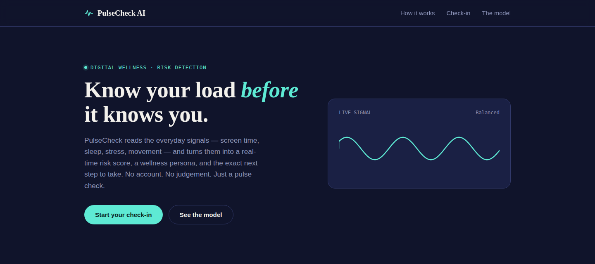
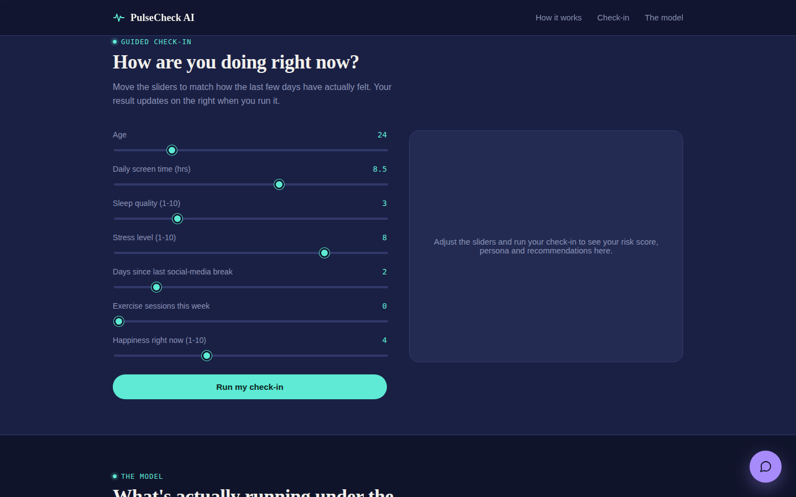
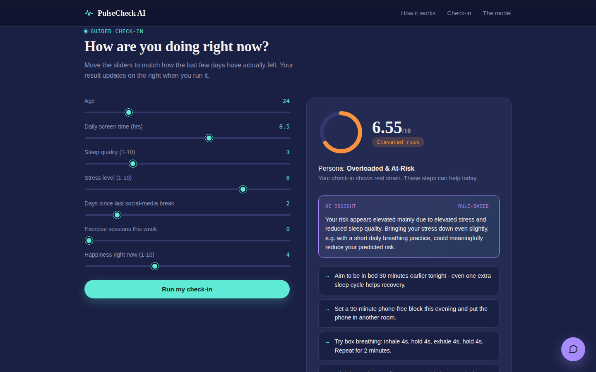
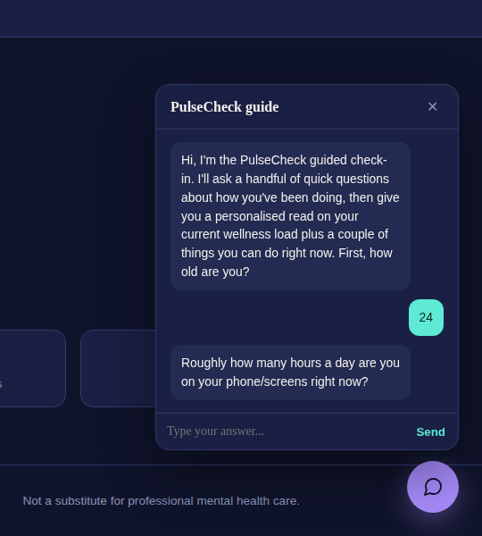

# PulseCheck AI

**Know your load before it knows you.**

[](https://manas0540.github.io/PulseCheck-AI/)


**[🔴 Live static demo →](https://manas0540.github.io/PulseCheck-AI/)** 

PulseCheck AI is an end-to-end digital-wellness platform that turns a short check-in — screen time, sleep, stress, exercise, mood — into a real-time **burnout/stress risk score**, a **wellness persona**, and **personalised, actionable guidance**, delivered through either a web dashboard or a guided conversational check-in.

It's a full rebuild of an earlier EDA-only notebook project into a real applied Data Science / ML system: feature engineering → trained models → a served API → a live web app.

> ⚠️ **Disclaimer:** PulseCheck AI is an educational/portfolio project, not a medical device. It does not diagnose any condition and is not a substitute for professional mental health care. If you or someone you know is in crisis, please contact a local emergency service or crisis line (see [Crisis resources](#crisis-resources) below).


## Screenshots

| | |
|---|---|
|  *Landing view — live animated risk waveform* |  *Guided check-in sliders* |
|  *Risk gauge, persona, tips, and AI insight* |  *Guided conversational check-in* |

*(Model metrics dashboard: `screenshots/model-metrics.png`)*

---

## Why this exists

The original project was a notebook that ran exploratory data analysis (skewness checks, histograms, a heatmap) over a digital-wellness survey dataset. It never actually *did* anything with the analysis. PulseCheck AI keeps the same dataset and problem statement but closes the loop:

1. **Sense** — capture a person's current state (screen time, sleep, stress, exercise, mood) through a form or a short chat.
2. **Score** — a trained regression model converts those signals into a 0–10 risk score; a clustering model places the person into one of four interpretable wellness personas.
3. **Act** — a rule-based recommendation engine returns 2–4 concrete, immediate actions (breathing exercise, digital detox block, sleep nudge, movement break), prioritised by that person's biggest risk driver.
4. **Escalate** — if the risk score crosses **8.5/10**, the platform stops recommending self-help tips and instead surfaces real crisis-support resources, per the project's original "serious stage" design requirement.


## Architecture

```
                     ┌───────────────────────┐
   digital_wellness   │  data_processing.py   │  cleans raw survey data,
   _raw.csv  ───────▶ │  (feature engineering)│  engineers Risk_Score / tiers
                     └──────────┬────────────┘
                                │ processed CSV
                                ▼
                     ┌───────────────────────┐
                     │   train_models.py     │  RandomForestRegressor (risk)
                     │                       │  KMeans (persona clustering)
                     └──────────┬────────────┘
                                │ risk_model.pkl, persona_model.pkl
                                ▼
   ┌────────────────────────────────────────────────────┐
   │                backend/main.py (FastAPI)            │
   │  /api/predict        one-shot form check-in         │
   │  /api/chat/start      begin guided conversation      │
   │  /api/chat/message    step through conversation       │
   │  recommender.py       rule-based tips + escalation    │
   └───────────────────────────┬──────────────────────────┘
                                │ JSON
                                ▼
                     ┌───────────────────────┐
                     │   frontend/index.html  │  dashboard + risk gauge +
                     │  (vanilla HTML/CSS/JS) │  floating guided-chat widget
                     └───────────────────────┘
```

## Tech stack

| Layer | Choice | Why |
|---|---|---|
| Data / features | pandas, numpy | cleaning + engineered `Risk_Score` target |
| Modelling | scikit-learn (RandomForestRegressor, KMeans) | interpretable, fast to train, no GPU needed |
| Backend / API | FastAPI + uvicorn | async, typed, auto-generated OpenAPI docs at `/docs` |
| Frontend | vanilla HTML/CSS/JS | zero build step, fully self-contained, easy to fork |
| Guided chatbot | deterministic rule-based state machine (`src/chatbot.py`) | runs fully offline — no API keys required to clone & run |

## Model performance

Trained on the 500-row `digital_wellness_raw.csv` dataset (80/20 split):

| Metric | Value |
|---|---|
| Risk model R² | **0.97** |
| Risk model MAE | **0.18** (on a 0–10 scale) |
| Persona clusters (k) | **4** |

Regenerate at any time:


### A design note on why the score isn't purely the model's output

The risk score a user is actually shown — and the one the crisis-escalation threshold checks — is computed from a **transparent, auditable formula** (`src/data_processing.py::compute_risk_score`), not directly from the RandomForest's prediction. The RF model is still trained on the same target and reported (`model_estimate` in the API response) as a validation signal.

Why: on a 500-row dataset, a tree ensemble under-predicts combinations of extreme values it never saw during training. Testing a worst-case check-in (max stress, min sleep, min happiness, max screen time) gives a true formula score of **8.58** — correctly above the escalation threshold — while the RF model alone predicted **6.7** for the same input, which would have silently suppressed the crisis-resources banner. For a safety-relevant decision like this one, an explainable rule beats a slightly-better-on-average black box. This trade-off is intentional and documented here rather than hidden.

### The four wellness personas

| Persona | Profile |
|---|---|
| **Balanced Thriver** | Low screen time, strong sleep, moderate stress, high happiness — lowest average risk |
| **Quietly Drifting** | Middling on every axis; not in crisis, but drifting toward strain |
| **Wired & Tired** | Decent mood on paper, but very low exercise and elevated stress — risk often hides here |
| **Overloaded & At-Risk** | High screen time, poor sleep, high stress, lower happiness — highest average risk |

Persona names are assigned dynamically from cluster centroids (see `src/train_models.py::name_personas`), so they stay meaningful even if the model is retrained on new data.

## Project structure

```
pulsecheck-ai/
├── data/
│   ├── raw/digital_wellness_raw.csv       # original survey data
│   └── processed/wellness_features.csv    # cleaned + engineered features
├── src/
│   ├── data_processing.py     # cleaning + Risk_Score feature engineering
│   ├── train_models.py        # trains + saves risk & persona models
│   ├── recommender.py         # rule-based tips + crisis escalation logic
│   ├── chatbot.py             # offline guided-check-in conversation engine
│   └── llm_explainer.py       # optional LLM (Groq/Gemini, both free-tier) explanation layer + rule-based fallback
├── models/                    # saved .pkl artifacts + metrics.json (generated)
├── backend/
│   ├── main.py                # FastAPI app (serves API + frontend)
│   └── schemas.py             # pydantic request models
├── frontend/
│   └── index.html             # single-page dashboard + chat widget (talks to the API)
├── docs/
│   ├── index.html             # STATIC demo build - same UI, runs fully client-side, no backend
│   └── README.md              # what's ported vs. simplified in the static build
├── screenshots/                # PNGs used in this README
├── notebooks/                 # original EDA notebook (kept for provenance)
├── PulseCheck_AI_One_Pager.pdf # one-page project summary (for portfolio/resume)
├── requirements.txt
├── LICENSE
└── README.md
```

## API reference

Full interactive docs are auto-generated at **`/docs`** once the server is running. Summary:

| Endpoint | Method | Body | Returns |
|---|---|---|---|
| `/api/predict` | POST | age, screen_time_hrs, sleep_quality, stress_level, days_without_social_media, exercise_frequency, happiness_index | risk_score, risk_tier, persona, tips, escalate, crisis_resources, model_estimate, ai_explanation |
| `/api/chat/start` | POST | session_id | opening chatbot message |
| `/api/chat/message` | POST | session_id, message | next chatbot message; full result (incl. `ai_explanation`) once all questions are answered |

## LLM Integration (free-tier)

By default, every result includes an `ai_explanation` — a short, plain-language read on *why* the score is what it is, generated from the exact same numbers the score was computed from:

> "Your risk appears elevated mainly due to elevated stress and reduced sleep quality. Improving your sleep consistency by roughly 30-45 minutes a night could meaningfully reduce your predicted risk."

This runs with **zero configuration**, using a deterministic rule-based template (`src/llm_explainer.py`) — it never invents a driver that isn't actually contributing, and for low-risk check-ins it says so plainly instead of forcing a "driver" narrative.

If you set a `GROQ_API_KEY` or `GEMINI_API_KEY` environment variable, the same function instead calls a free-tier LLM to phrase the explanation more fluently, grounded in an identical contribution breakdown. **Groq is tried first** (fast, generous free tier, Llama models), then **Gemini** as a fallback if only that key is set:

```bash
# Get a free key at https://console.groq.com
export GROQ_API_KEY=gsk_...

# or, get a free key at https://aistudio.google.com
export GEMINI_API_KEY=...

uvicorn backend.main:app --reload --port 8000
```

Both providers were chosen specifically because they have genuinely free tiers with no billing setup required — appropriate for a project meant to be cloned and run by anyone.

Design guarantees:
- The LLM **never** sets the risk score, tier, persona, or the crisis-escalation decision — it only narrates numbers already computed elsewhere.
- Any failure (no key, missing `groq`/`google-genai` package, network error, rate limit) silently falls back to the rule-based template. The check-in flow can't break because of this layer.
- The API response always includes `ai_explanation.source` (`"llm"` or `"rule_based"`) so the frontend — and you — can see which path produced the text; the UI surfaces this as a small badge rather than hiding it.

## Crisis resources

## Crisis Support Resources

If a check-in result indicates a **critical risk level (>8.5/10)**, PulseCheck AI prioritizes safety by displaying crisis support resources instead of only providing wellness recommendations.

If you or someone you know needs immediate support:

- 🇮🇳 **India:** Tele-MANAS Mental Health Helpline — Call **14416** or **1-800-891-4416**  
  https://telemanas.mohfw.gov.in/


## Roadmap

- [ ] Persist check-ins so a user can see their risk trend over time
- [ ] Add authentication + per-user history (currently fully anonymous/stateless)
- [ ] Package as a Docker image for one-command deploy

## Contributing

Issues and PRs welcome. Please run `python src/train_models.py` and confirm the FastAPI server starts cleanly before submitting.

## License

MIT — see [LICENSE](LICENSE).
